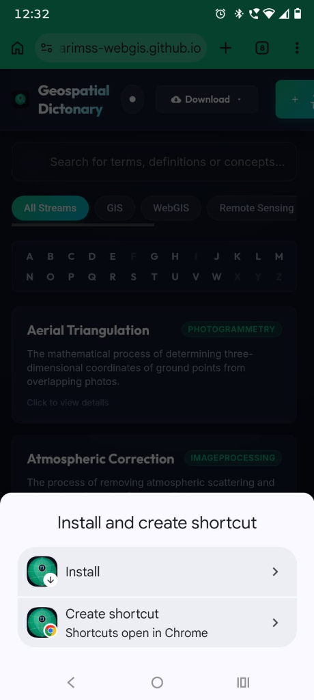

  <h1 style="color: #06b6d4; font-family: 'Outfit', sans-serif; font-size: 2rem; border-bottom: 2px solid #06b6d4; padding-bottom: 8px; margin-bottom: 12px; font-weight: 800;">📖 Geospatial Dictionary: User Guide & Manual</h1>

  

    Welcome to the <strong style="color: #38bdf8;">Geospatial Dictionary</strong>! This guide explains how to search for terms, contribute new definitions, install the app, and remove it from your devices.
  

  

  <!-- Live URL Box -->
  

    <h3 style="color: #10b981; font-size: 1.1rem; margin-top: 0; margin-bottom: 8px; display: flex; align-items: center; gap: 6px; font-weight: bold;">
      🌐 Live Website & PWA URL
    </h3>
    <ul style="margin: 0; padding-left: 20px; color: #a7f3d0; font-size: 0.95rem;">
      <li><strong>Live Website Link:</strong> <a href="https://harimss-webgis.github.io/Geospatial-Dictionary/" style="color: #34d399; font-weight: bold; text-decoration: underline;">https://harimss-webgis.github.io/Geospatial-Dictionary/</a></li>
      <li style="margin-top: 6px;"><strong>PWA App URL:</strong> Same as above! (Open this link in your browser to run the app or trigger installation).</li>
    </ul>
  

  

  <!-- Section 1 -->
  <h2 style="color: #38bdf8; font-family: 'Outfit', sans-serif; font-size: 1.4rem; margin-top: 24px; margin-bottom: 12px; font-weight: 700;">🔍 1. Searching for Geospatial Terms</h2>
  
  <ul style="padding-left: 20px; color: #cbd5e1;">
    <li style="margin-bottom: 8px;"><strong style="color: #f8fafc;">Search Box:</strong> Type any word or acronym (e.g. <em>GPS</em>, <em>RTK</em>, <em>CRS</em>, <em>Shapefile</em>) into the main search box at the top.</li>
    <li style="margin-bottom: 8px;"><strong style="color: #f8fafc;">Stream Categories:</strong> Use the filter chips (All Streams, GIS, WebGIS, GNSS, Remote Sensing, Image Processing, Photogrammetry) to narrow down card lists instantly.</li>
    <li style="margin-bottom: 8px;"><strong style="color: #f8fafc;">Recommendations:</strong> As you type, suggestions will drop down under the search box. You can use your keyboard keys:
      <ul style="margin-top: 6px; padding-left: 20px;">
        <li style="margin-bottom: 4px;">Use ↑ ArrowUp or ↓ ArrowDown to scroll through suggestions.</li>
        <li>Press Enter to open the selected term's details immediately.</li>
      </ul>
    </li>
  </ul>

  

  <!-- Section 2 -->
  <h2 style="color: #38bdf8; font-family: 'Outfit', sans-serif; font-size: 1.4rem; margin-top: 24px; margin-bottom: 12px; font-weight: 700;">✍️ 2. Adding a New Term Manually</h2>
  

    If you want to contribute a term from your own knowledge, click the ➕ <strong style="color: #38bdf8;">"+ Add Term"</strong> button in the header bar and fill in these fields:
  

  <ol style="padding-left: 20px; color: #cbd5e1;">
    <li style="margin-bottom: 10px;">
      <strong style="color: #f8fafc;">Term Title:</strong>
      

        The name of the term (e.g., <em>Multipath Error</em>).  
        *Note: If you enter a title that already exists, the form will display a warning dropdown letting you switch to Edit Mode instead.*
      

    </li>
    <li style="margin-bottom: 10px;">
      <strong style="color: #f8fafc;">Definition:</strong>
      
A clear, accurate explanation of what the term means. Focus on geospatial accuracy.

    </li>
    <li style="margin-bottom: 10px;">
      <strong style="color: #f8fafc;">Category Stream:</strong>
      
Select the category that fits best (e.g., choose <strong>GNSS</strong> for GPS/satellite concepts, or <strong>GIS</strong> for coordinate reference systems).

    </li>
    <li style="margin-bottom: 10px;">
      <strong style="color: #f8fafc;">Aliases (Synonyms):</strong>
      
Any other names this term is known by, separated by commas (e.g. <em>Global Positioning System, NAVSTAR</em> for GPS).

    </li>
    <li style="margin-bottom: 10px;">
      <strong style="color: #f8fafc;">Related Terms:</strong>
      
List associated concepts, separated by commas, so users can find them easily (e.g. <em>RTK, GNSS, Galileo</em>).

    </li>
    <li style="margin-bottom: 10px;">
      <strong style="color: #ef4444; font-size: 0.95rem;">🖼️ Upload Illustration (Mandatory File Upload):</strong>
      

        You must upload an image or diagram that fits the term. Adding an image/diagram is mandatory to ensure definition cards are easy to understand visually for all users.
      

    </li>
  </ol>

  

  <!-- Section 3 -->
  <h2 style="color: #38bdf8; font-family: 'Outfit', sans-serif; font-size: 1.4rem; margin-top: 24px; margin-bottom: 12px; font-weight: 700;">⚡ 3. Using "Auto-Fill" (Google / Wikipedia Lookup)</h2>
  

    To save time, the dictionary can automatically search and fetch descriptions from Wikipedia:
  

  <h3 style="color: #f8fafc; font-size: 1rem; margin-top: 12px; margin-bottom: 6px; font-weight: 600;">🚀 How to use it:</h3>
  <ol style="padding-left: 20px; color: #cbd5e1; margin-bottom: 15px;">
    <li style="margin-bottom: 4px;">Tap the ➕ <strong>"+ Add Term"</strong> button.</li>
    <li style="margin-bottom: 4px;">Type the name of the term you want to add into the <strong>Term Title</strong> field.</li>
    <li style="margin-bottom: 4px;">Stop typing and wait <strong>1 second</strong> (or click/tap outside the Title box).</li>
    <li style="margin-bottom: 4px;">The system will search in the background. If a match is found, it will automatically fill in the form fields.</li>
  </ol>

  <!-- High-contrast Warning Box -->
  

    <strong style="color: #f87171; display: block; margin-bottom: 4px;">⚠️ IMPORTANT: Verify and Edit Auto-Filled Content!</strong>
    
      While the auto-fill feature is fast, automatic search definitions can sometimes be inaccurate, out-of-context, or incomplete. 
      <strong style="color: #fca5a5;">If any of the auto-filled information is wrong or incomplete, you are requested to edit and correct the text manually before clicking "Save Term".</strong>
    
  

  

  <!-- Section 4 -->
  <h2 style="color: #38bdf8; font-family: 'Outfit', sans-serif; font-size: 1.4rem; margin-top: 24px; margin-bottom: 12px; font-weight: 700;">📲 4. How to Install & Uninstall the App (PWA)</h2>
  
  
This matches the exact visual guide shown inside the website popup:

  

    
  

  <!-- Install Methods Container -->
  

    <h3 style="color: #f8fafc; font-size: 1.1rem; margin-top: 0; margin-bottom: 12px; font-weight: 600;">📥 How to Download & Install:</h3>
    <ol style="padding-left: 20px; color: #cbd5e1; margin: 0;">
      <li style="margin-bottom: 10px;">Open the website: <a href="https://harimss-webgis.github.io/Geospatial-Dictionary/" style="color: #38bdf8; text-decoration: underline;">https://harimss-webgis.github.io/Geospatial-Dictionary/</a></li>
      <li style="margin-bottom: 10px;">Click the 💾 <strong>Download</strong> button at the top header and select <strong>Download App</strong>.</li>
      <li style="margin-bottom: 10px;">Choose the guide for your device:
        <ul style="margin-top: 6px; padding-left: 20px;">
          <li style="margin-bottom: 6px;"><strong style="color: #38bdf8;">🔵 Method A (Desktop Installation):</strong> Click the <strong>Install Monitor icon</strong> on the right side of the address bar, or select <strong>Cast, save, and share ➔ Install Geospatial Dictionary...</strong> in your settings menu.</li>
          <li style="margin-bottom: 6px;"><strong style="color: #34d399;">🟢 Method B (Mobile Android Menu):</strong> Tap Chrome's top-right three vertical dots (⋮) and select <strong>Install</strong> (or <strong>Install and create shortcut</strong>), then select <strong>Install</strong>.</li>
          <li style="margin-bottom: 6px;"><strong style="color: #fb923c;">🟡 Method C (iPhone iOS Safari):</strong> Open Safari, tap the <strong>Share sheet button</strong> (box with up arrow), and select <strong>Add to Home Screen</strong>.</li>
        </ul>
      </li>
      <li style="margin-top: 6px;">📶 <strong style="color: #38bdf8;">Offline Capability:</strong> Once installed, the app works fully <strong>offline</strong> without any internet connection!</li>
    </ol>
  

  <!-- PWA vs Shortcut Details -->
  

    <h4 style="color: #ffffff; font-size: 0.95rem; margin-top: 0; margin-bottom: 8px; font-weight: bold;">⚖️ App Install vs. Web Shortcut (Android Chrome Details):</h4>
    <ul style="margin: 0; padding-left: 20px; color: #cbd5e1; font-size: 0.85rem;">
      <li style="margin-bottom: 6px;"><strong style="color: #ffffff;">Install (App):</strong> Downloads PWA files directly. Opens in its own window (no tabs) and works offline. To delete, press and hold and select <strong>Uninstall</strong>.</li>
      <li><strong style="color: #ffffff;">Create Shortcut:</strong> Places a link on your screen. Accesses the site without installing files. To delete, press and hold and select <strong>Remove</strong>.</li>
    </ul>
  

  <!-- Uninstall Details -->
  

    <h4 style="color: #ef4444; font-size: 0.95rem; margin-top: 0; margin-bottom: 8px; font-weight: bold;">🗑️ How to Remove or Uninstall from Phone:</h4>
    <ul style="margin: 0; padding-left: 20px; color: #fca5a5; font-size: 0.85rem;">
      <li style="margin-bottom: 6px;"><strong>If you chose 'Install':</strong> Press and hold the icon on your home screen and select <strong>Uninstall</strong>.</li>
      <li><strong>If you chose 'Create shortcut':</strong> Press and hold the icon and select <strong>Remove</strong> (or drag to the 'Remove' trash can at the top).</li>
    </ul>
  

